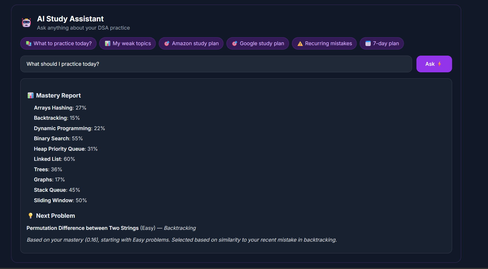
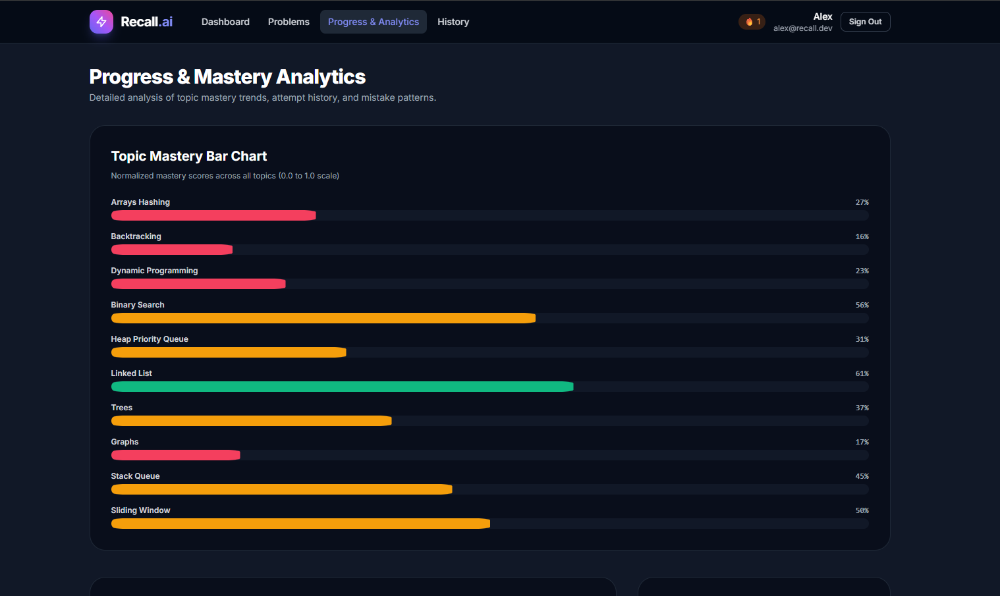
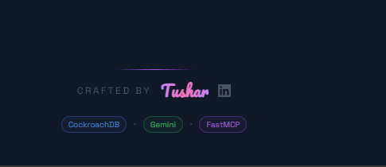

# Recall.ai — Persistent Memory MCP Server for DSA Practice

> **Your AI coding practice has amnesia. Recall fixes that.**

[](https://dsa-mcp.onrender.com)
[]()
[]()
[]()
[]()

Recall is an open-source **Model Context Protocol (MCP) server** that gives AI coding assistants long-term, structured memory of your DSA practice. Connect Cursor, Claude Desktop, or VS Code and let your AI tutor remember your weaknesses, track your mistakes, and plan your interview prep — automatically.

---

## ⚡ Quick Connect (No Installation Required)

Recall is live on Render. Add this to your `claude_desktop_config.json` and restart Claude Desktop — no setup needed:

**Windows:** `%APPDATA%\Claude\claude_desktop_config.json`
**Mac:** `~/Library/Application Support/Claude/claude_desktop_config.json`

```json
{
  "mcpServers": {
    "recall": {
      "type": "sse",
      "url": "https://dsa-mcp.onrender.com/sse"
    }
  }
}
```

> **Note:** The server is on Render free tier — first request may take ~30 seconds to wake up. Subsequent requests are fast.

---

## 🌐 Live Demo

| | |
|---|---|
| **Web Dashboard** | https://dsa-mcp.onrender.com |
| **MCP Endpoint** | https://dsa-mcp.onrender.com/mcp |
| **Health Check** | https://dsa-mcp.onrender.com/health |
| **Demo Login** | alex@recall.dev / recall@demo123 |

---

## 🎯 Why Recall Exists

| Problem | Recall's Solution |
|---------|-----------------|
| AI assistants forget everything between sessions | Persistent memory via MCP protocol |
| LeetCode only tracks pass/fail, not WHY you failed | Vector embeddings of mistake patterns |
| No personalized problem recommendations | Epsilon-greedy weak topic selection |
| No company-specific interview prep | 3,359 problems tagged with 129+ companies |
| Mastery fades without practice | 14-day exponential decay formula |

---

## 🔧 8 MCP Tools

| Tool | Trigger | What it does |
|------|---------|-------------|
| `get_or_create_user` | Session start | Register/fetch user by email |
| `get_mastery_report` | "How am I doing?" | Topic mastery with 14-day decay |
| `log_attempt` | After solving | Record attempt + generate mistake embeddings |
| `suggest_next_problem` | "What to practice?" | Epsilon-greedy weak topic + vector ranking |
| `flag_recurring_mistake` | Code review | Cosine similarity vs past mistake embeddings |
| `get_problem_context` | Starting a problem | Problem details + similar past attempts |
| `study_plan` | "Prepare for Amazon" | 7-day company-specific study plan |
| `say_hello` | Connection test | Verify MCP server connection |

---

## 🧠 How Memory Works

### 1. Episodic Memory — Attempt History
Every attempt logged: problem, outcome, code, time, mistakes.

### 2. Semantic Memory — Decaying Mastery Scores

mastery(t) = base_score × 0.5^(days_elapsed / 14)

Score 0.80 in Binary Search → don't practice for 14 days → score drops to 0.40. **GitHub Actions** runs nightly decay at midnight UTC automatically.

### 3. Vector Memory — Mistake Pattern Detection
Your mistake → Gemini text-embedding-004 → 768-dim vector → stored in CockroachDB  
Next similar code → cosine similarity check → similarity > 0.35 → WARNING!

---

## 🏗️ Architecture

```text
┌────────────────────────────────────────────────────┐
│                    CLIENT LAYER                    │
│ Cursor/Claude Desktop │  VS Code   │  Web Browser  │
│      (MCP stdio)      │ Extension  │    (HTTPS)    │
└──────────────┬─────────────────────────────────────┘
               │ MCP Protocol / REST API
               ▼
┌────────────────────────────────────────────────────┐
│              RENDER PRODUCTION SERVER              │
│     FastMCP (8 tools) + FastAPI Web Dashboard      │
│    Rate Limiting (slowapi) + Structured Logging    │
└────────────┬──────────────────┬────────────────────┘
             │                  │
             ▼                  ▼
┌──────────────────┐  ┌────────────────────────────┐
│   CockroachDB    │  │     Google Gemini API      │
│    Serverless    │  │     text-embedding-004     │
│  3,359 problems  │  │  768-dimensional vectors   │
│ HNSW vector idx  │  └────────────────────────────┘
└──────────────────┘
             │
             ▼
┌──────────────────┐
│  GitHub Actions  │
│   Nightly Decay  │
│    0 0 * * *     │
└──────────────────┘
```

---

## 📸 Screenshots

### Web Dashboard — Mastery Overview


### AI Study Assistant


### Problems Browser (3,359 problems with company tags)


### Progress & Analytics


### VS Code Extension — Live Mastery Sidebar


---

## 🚀 Local Setup

### Prerequisites
- Python 3.11+
- [uv](https://github.com/astral-sh/uv) package manager
- CockroachDB Serverless account (free tier)
- Google AI Studio API key (free)

### Installation

```bash
# Clone repository
git clone https://github.com/tushar-2-5/DSA_MCP.git
cd DSA_MCP

# Install dependencies
uv sync

# Configure environment
cp .env.example .env
# Edit .env — add DATABASE_URL and GEMINI_API_KEY

# Apply database migrations
uv run python scripts/apply_migration.py

# Seed problem database (3,359 problems)
uv run python scripts/seed_problems.py
uv run python scripts/seed_company_problems.py

# Generate embeddings
uv run python scripts/embed_seed_problems.py

# Run tests (49 should pass)
uv run pytest -v

# Start local server
uv run python -m server.main
```

### Local MCP Config
```json
{
  "mcpServers": {
    "recall": {
      "command": "uv",
      "args": ["--directory", "/path/to/DSA_MCP", "run", "python", "-m", "server.main"]
    }
  }
}
```

**Or connect to the live server (no local setup needed):**
```json
{
  "mcpServers": {
    "recall": {
      "type": "sse",
      "url": "https://dsa-mcp.onrender.com/sse"
    }
  }
}
```

---

## Live Deployment (Render)

Recall is deployed on Render at `https://dsa-mcp.onrender.com`.

| Endpoint | Purpose |
|---|---|
| `GET /health` | Health check |
| `GET /sse` | SSE transport for Claude Desktop |
| `POST /mcp` | Streamable HTTP transport |

To deploy your own instance:
1. Fork this repo
2. Connect to [render.com](https://render.com) → New Web Service → select your fork
3. Add environment variables: `DATABASE_URL`, `GEMINI_API_KEY`
4. Deploy — `render.yaml` handles the rest

---

## 🧪 Test Suite

```text
49 passed in 16.96s
├── integration/
│   ├── test_user_lifecycle
│   ├── test_study_plan_integration
│   ├── test_company_filtering
│   └── test_error_recovery
└── unit/
    ├── test_dashboard (8 tests)
    ├── test_gemini_client (4 tests)
    ├── test_mastery (5 tests)
    ├── test_mcp_server (2 tests)
    ├── test_recommendation (6 tests)
    └── test_validation (20 tests)
```

---

## 🛠️ Tech Stack

| Layer | Technology | Purpose |
|-------|-----------|---------|
| MCP Server | FastMCP + Python 3.11 | 8 MCP tools via stdio/HTTP |
| Web Dashboard | FastAPI + Jinja2 + Alpine.js | User interface |
| Database | CockroachDB Serverless | Distributed SQL + vector search |
| Vector Index | HNSW (cosine similarity) | Fast mistake pattern matching |
| Embeddings | Google Gemini text-embedding-004 | 768-dim mistake vectors |
| Auth | bcrypt + Starlette sessions | Secure password hashing |
| Rate Limiting | slowapi | API abuse protection |
| Deployment | Render | Production hosting |
| CI/CD | GitHub Actions | Nightly decay cron |
| VS Code | TypeScript Extension | IDE integration |

---

## ✅ Project Status

| Feature | Status | Details |
|---------|--------|---------|
| 8 MCP Tools | ✅ Complete | All tools tested and verified |
| Web Dashboard | ✅ Complete | Login, problems, mastery, analytics |
| Password Authentication | ✅ Complete | bcrypt hashing, session management |
| 3,359 Company Problems | ✅ Complete | 129+ companies tagged |
| AI Study Assistant | ✅ Complete | Smart query routing on dashboard |
| VS Code Extension | ✅ Complete | Live mastery sidebar + notifications |
| Mastery Decay Engine | ✅ Complete | 14-day exponential half-life |
| Vector Mistake Detection | ✅ Complete | 768-dim cosine similarity |
| Nightly Decay Cron | ✅ Complete | GitHub Actions (0 0 * * *) |
| Rate Limiting | ✅ Complete | slowapi middleware |
| Integration Tests | ✅ Complete | 49/49 passing |
| Pagination | ✅ Complete | 50 problems per page |

---

## 📄 License

MIT License — see [LICENSE](LICENSE)

---

*Built for hackathon by Tushar · IIT ISM Dhanbad · 2026*
