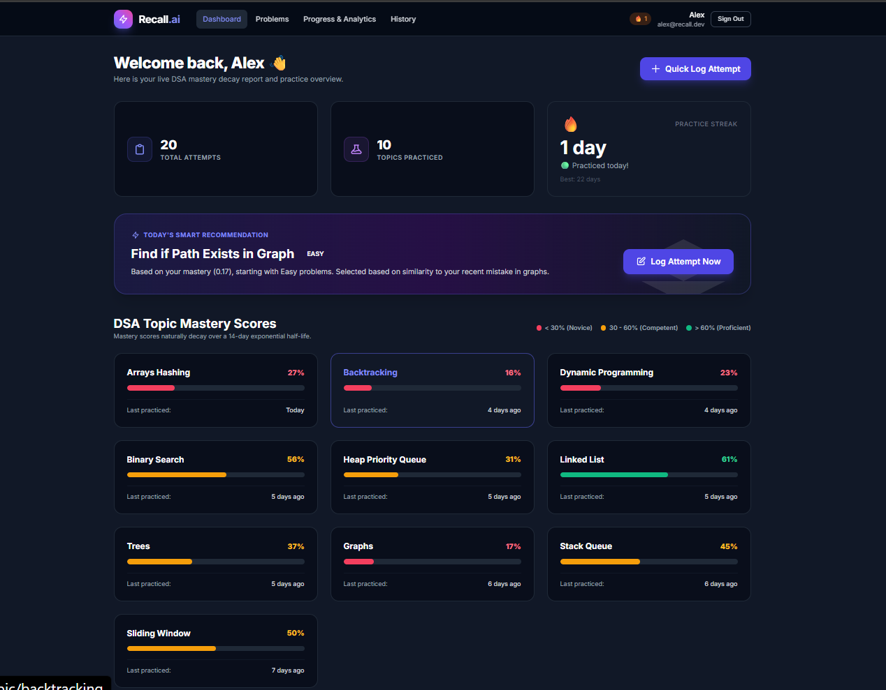
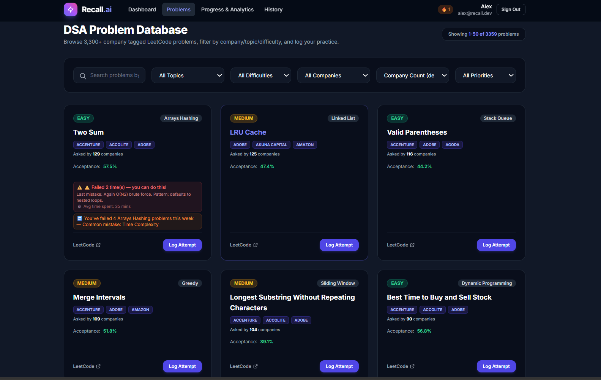

# Recall — Persistent Memory MCP Server for DSA Practice

Recall is an open-source Model Context Protocol (MCP) server that gives AI coding assistants long-term, structured memory of a developer's Data Structures & Algorithms (DSA) practice. Current AI coding assistants suffer from total amnesia between sessions—they cannot track which topics you struggle with, which bugs you repeatedly make, or how your problem-solving speed evolves over time. Recall solves this by connecting IDEs (like Claude Code or Cursor) to a dual-layer memory backend built on CockroachDB Serverless and Google Gemini embeddings. It combines structured mastery scoring with 14-day exponential memory decay and 768-dimensional vector similarity search over historical code submissions and mistake patterns, turning standard AI pair programmers into personalized algorithms tutors that learn your weaknesses over time.

---

## Why Recall Exists

When developers practice DSA problems, the biggest bottleneck isn't finding problem statements—it's maintaining a structured learning loop. Traditional platform trackers like LeetCode record pass/fail counts, but offer no qualitative memory of *why* you failed, what specific logical flaw tripped you up, or whether you made that exact same off-by-one error three weeks ago on a different sliding-window problem.

At the same time, modern AI coding assistants are completely stateless across sessions. Every time you open a fresh chat window, your AI tutor starts from zero. It doesn't know you struggle with shrinking window conditions, that your dynamic programming mastery has decayed after two weeks of inactivity, or that you prefer Python syntax over C++.

Recall bridges this gap by introducing **agentic memory** for technical interview prep. Instead of treating every problem as an isolated prompt, Recall enables your AI assistant to maintain three distinct forms of memory: episodic logs of past attempts, semantic mastery scores that naturally decay over time, and vector embeddings of code submissions and logical errors. The result is an assistant that actively flags recurring bugs before you submit, routes you to weak topics based on real performance data, and tailors problem recommendations to your specific struggle patterns.

---

## Architecture

```text
┌─────────────────────────────────────────────────────────────┐
│                   IDE / Coding Agent                        │
│     Claude Desktop · Cursor · Windsurf · Continue           │
└─────────────────────────────┬───────────────────────────────┘
                              │
               MCP Protocol (stdio / SSE / HTTP)
                              │
                              ▼
┌─────────────────────────────────────────────────────────────┐
│                 Recall MCP Server (Python)                  │
│   FastMCP · JWT Auth · Pydantic v2 · Structured Logging     │
│                                                             │
│   Tools:                                                    │
│   get_or_create_user   │ get_mastery_report                 │
│   log_attempt          │ suggest_next_problem               │
│   get_problem_context  │ flag_recurring_mistake             │
│   study_plan           │ say_hello                          │
└──────────┬──────────────────────┬───────────────────────────┘
           │                      │
           ▼                      ▼
┌─────────────────┐    ┌─────────────────────┐
│  CockroachDB    │    │  Google Gemini AI   │
│   Serverless    │    │  text-embedding-004 │
│                 │    │  768-dim vectors    │
│ • users         │    └─────────────────────┘
│ • problems      │
│ • attempts      │    ┌─────────────────────┐
│ • mastery       │    │   GitHub Actions    │
│ • mistakes      │    │  Nightly Decay Cron │
│ • embeddings    │    │   00:00 UTC daily   │
│ • topics        │    └─────────────────────┘
│                 │
│ HNSW Vector     │    ┌─────────────────────┐
│ Index (768-dim) │    │    Web Dashboard    │
│ 3,359 problems  │    │  FastAPI + Railway  │
│ 454 embeddings  │    │  Jinja2 + Alpine.js │
└─────────────────┘    └─────────────────────┘
```

**Request Flow:**  
User types in IDE  
→ Claude detects intent  
→ Calls Recall MCP tool  
→ Tool queries CockroachDB + Gemini  
→ Returns structured memory response  
→ Claude gives personalized advice  

### MCP Tools API

Recall exposes 8 MCP tools to the AI coding agent via the Model Context Protocol:

| Tool Name | Trigger Context | Description |
|---|---|---|
| `say_hello` | User opens session | Connection test and greeting |
| `get_or_create_user` | User opens session or introduces themselves | Registers a new user or fetches an existing user profile by email address. |
| `get_mastery_report` | User asks "How am I doing?" or "Show my progress" | Returns overall mastery percentage and per-topic breakdowns with skill tiers (Novice, Competent, Proficient, Master). |
| `log_attempt` | User submits code or finishes a problem | Records attempt outcome (`pass`, `fail`, `partial`), updates decaying topic mastery, and stores code/mistake embeddings. |
| `get_problem_context` | User starts working on a specific problem | Retrieves problem statement, metadata, prerequisites, and vector-similar past attempts to highlight relevant history. |
| `flag_recurring_mistake` | User is actively writing code and asks the agent to check for patterns, or agent proactively warns during code review | Compares in-progress code against the user's historical mistake embeddings to detect and warn of recurring bug patterns. |
| `suggest_next_problem` | User asks "What should I practice next?" | Selects weak topics using epsilon-greedy exploration, determines difficulty band, and ranks unattempted problems by similarity to recent mistake embeddings. |
| `study_plan` | User asks for a study plan | Generates personalized 7-day study plan targeting weak topics |

---

## Quick Connect (No Local Setup Required)

Connect to Recall's hosted MCP server instantly — no Python, no local setup:

### Claude Desktop
Add to `%APPDATA%\Claude\claude_desktop_config.json`:
```json
{
  "mcpServers": {
    "recall": {
      "command": "npx",
      "args": ["-y", "mcp-remote", "https://dsa-mcp.onrender.com/mcp"]
    }
  }
}
```
Restart Claude Desktop. Then in chat:
> "Register me on Recall with email your@email.com"

### Cursor
Add to `~/.cursor/mcp.json` — same config as above.

---

## Screenshots

### Web Dashboard — Mastery Overview


### Web Dashboard — AI Study Assistant


### Web Dashboard — Problem Browser


### Claude Desktop — Live MCP Integration


> 📸 Screenshots coming soon — see live demo at [https://web-production-54438.up.railway.app](https://web-production-54438.up.railway.app)

---

## How to Use

### Step 1 — Connect to Recall
Add the remote MCP config to your IDE (see Quick Connect above). Restart your IDE.

### Step 2 — Register yourself
In your IDE chat, type:
> "Register me on Recall: your@email.com"

Claude will call `get_or_create_user` and return your user_id and token. Save these — Claude will use them automatically in future messages.

### Step 3 — Check your progress
> "How am I doing with DSA? Show my mastery report."

Claude calls `get_mastery_report` and shows your topic-wise scores with decay information.

### Step 4 — Get a recommendation
> "What should I practice today?"

Claude calls `suggest_next_problem` — picks your weakest topic, selects appropriate difficulty, and finds a problem similar to your past mistakes.

### Step 5 — Practice and log
Solve a problem, then tell Claude:
> "I just solved Two Sum. Took 20 mins, used HashMap, O(N) solution."

Claude calls `log_attempt` — saves your attempt, updates mastery, stores code embedding.

### Step 6 — Get warned about recurring mistakes
While writing code, ask Claude:
> "Check my code for recurring mistakes."

Paste your code. Claude calls `flag_recurring_mistake` — compares your code against past mistake embeddings and warns you instantly.

### Example Conversation

```text
You: "I'm alex@example.com. What should I practice today?"

Claude: [calls get_or_create_user + get_mastery_report + suggest_next_problem]
"Welcome back Alex! Your weakest topic is Backtracking at 17%.
I recommend: Min Cost Climbing Stairs (Easy)
This is similar to a mistake you made 3 days ago in dynamic programming.
Based on your mastery (0.17), starting with Easy problems."

You: [solves problem] "Done! Failed, used brute force again."

Claude: [calls log_attempt]
"Logged! ⚠️ This is the 3rd time you've used brute force on
array problems. Consider HashMap approach — you have 67% mastery
in Arrays & Hashing, this should be within reach."
```

---

## Web Dashboard
Live at: https://web-production-54438.up.railway.app

Features:
- Secure login/signup
- Mastery scores with decay visualization  
- Practice streak tracker
- AI Study Assistant
- 3,359 problems with company filters
- Attempt history + topic deep dive
- Past attempt warnings with spaced repetition

---

## How the Memory Works

Recall implements a three-tier memory architecture designed to emulate real cognitive skill retention:

### 1. Episodic Memory (Attempt History)
Every submission made by a user is logged as an immutable episode in the `attempts` table. An attempt stores the problem ID, code submission, outcome status (`pass`, `fail`, or `partial`), target complexity achieved, time spent, and exact timestamp. When an attempt fails or achieves sub-optimal complexity, a linked `mistakes` record is created containing a qualitative summary and mistake category (such as `sliding_window_off_by_one` or `boundary_condition`).

### 2. Semantic Memory (Decaying Mastery Scores)
Mastery is tracked per-topic on a normalized continuous scale from `0.0` (unpracticed) to `1.0` (mastered). To model human memory retention, topic mastery decays exponentially based on elapsed time since last practice:

mastery(t) = mastery_0 * 0.5^(days_elapsed / 14)

The half-life is set to 14 days—meaning if you achieve a mastery score of 0.80 in Binary Search but do not practice it for two weeks, your effective mastery decays to 0.40. When you log a new attempt, your base score updates from the decayed value: passing an optimal solution increases your score, while failing decreases it.

### 3. Vector Memory (Error & Problem Pattern Similarity)
Recall uses 768-dimensional vector embeddings generated by Google Gemini (`text-embedding-004`) to index both problem statements and user mistake code snippets. Embeddings are stored natively in CockroachDB using CockroachDB's native vector type and HNSW indexing (`vector_cosine_ops`). When an agent suggests your next problem or checks your code for recurring mistakes, it performs cosine distance (`<->`) queries to identify mathematical and structural similarities between what you are working on now and how you have failed in the past.

---

## Tech Stack

| Component | Technology | Why Chosen |
|---|---|---|
| **MCP Server** | FastMCP (Python 3.11+) | Official, lightweight Python framework for exposing typed tools to MCP clients cleanly. |
| **Database** | CockroachDB Serverless | Distributed SQL database providing PostgreSQL compatibility, high availability, and native vector search. |
| **Vector Search** | CockroachDB HNSW Index | Natively index and execute high-speed cosine distance queries (`<->`) over 768-dim embeddings directly in SQL. |
| **Embeddings** | Google Gemini (`google-genai` SDK) | Generates fast, high-quality 768-dimensional embeddings via `text-embedding-004`. |
| **Package Manager** | `uv` | Blazing-fast Python package resolver and environment manager. |
| **Validation** | Pydantic v2 | Strict runtime type enforcement and schema generation for all tool arguments and model entities. |

---

## Getting Started (Local Setup)

### Prerequisites
- **Python 3.11+**
- **`uv` package manager**: `pip install uv` or `curl -LsSf https://astral.sh/uv/install.sh | sh`
- **CockroachDB Serverless Account**: Free tier PostgreSQL-compatible database with native vector support
- **Google AI Studio API Key**: Free API key for Gemini embeddings

### Setup Instructions

#### 1. Clone the repository
```bash
git clone https://github.com/tushar-2-5/DSA_MCP.git
cd "DSA PROJECT MCP"
```

#### 2. Install dependencies
```bash
uv sync
```

#### 3. Configure environment variables
Create a `.env` file in the project root:
```env
DATABASE_URL=postgresql://<user>:<password>@<host>:26257/<database>?sslmode=verify-full
GEMINI_API_KEY=your_gemini_api_key_here
```

#### 4. Apply database migrations
Run the database migrations script to create tables and vector indexes:
```bash
$env:PYTHONPATH="."; uv run python scripts/apply_migration.py
```
*(On Linux/macOS: `PYTHONPATH=. uv run python scripts/apply_migration.py`)*

#### 5. Seed topics and problem database
Seed the database with 3,359 LeetCode problems with company tags:
```bash
$env:PYTHONPATH="."; uv run python scripts/seed_problems.py
```

#### 6. Generate problem embeddings
Generate vector embeddings for all seed problems:
```bash
$env:PYTHONPATH="."; uv run python scripts/embed_seed_problems.py
```

#### 7. Register the MCP server in your IDE
Add Recall to your Claude Code or Cursor MCP config file (`mcp_config.json`):

*(Note: Replace `/absolute/path/to/recall` with your actual project directory path)*

```json
{
  "mcpServers": {
    "recall": {
      "command": "uv",
      "args": [
        "--directory",
        "/absolute/path/to/recall",
        "run",
        "python",
        "-m",
        "server.main"
      ]
    }
  }
}
```

#### 8. Verify installation
Run the unit test suite to confirm everything is configured properly:
```bash
$env:PYTHONPATH="."; uv run pytest -v
```

---

## Railway Deployment (Remote MCP Server)

Recall can be deployed to [Railway](https://railway.app) as a public remote MCP server running over HTTP/HTTPS (Streamable-HTTP transport):

1. **Deploy to Railway**: Connect your GitHub repository (`DSA_MCP`).
2. **Environment Variables**: Add `DATABASE_URL`, `GEMINI_API_KEY`, and `MCP_TRANSPORT=streamable-http`.
3. **Public Endpoint**: Generate a public domain under Railway Settings. Your public MCP endpoint will be:
   `https://<YOUR_RAILWAY_DOMAIN>/mcp`
4. **Connect Cursor**: Add the remote URL to Cursor MCP settings:
   ```json
   {
     "mcpServers": {
       "recall-remote": {
         "url": "https://<YOUR_RAILWAY_DOMAIN>/mcp"
       }
     }
   }
   ```

For full details, database initialization, and troubleshooting, see [DEPLOY_RAILWAY.md](file:///c:/Users/KIIT/OneDrive/Desktop/DSA%20PROJECT%20MCP/DEPLOY_RAILWAY.md).

### Nightly Decay Cron (GitHub Actions)
A GitHub Actions workflow runs `scripts/decay_handler.py` every night 
at midnight UTC. This applies 14-day exponential mastery decay to all users.
Triggered automatically via cron or manually via workflow_dispatch.

---

## Usage Examples

Once registered, you can interact with Recall naturally inside your IDE chat:

### Example 1: Registering & Checking Mastery
> **User**: *"Hi, I'm alex@example.com. How is my DSA progress looking today?"*  
> **Assistant**: *(Calls `get_or_create_user`, then `get_mastery_report`)*  
> **Assistant**: *"Welcome back Alex! Your overall mastery score is **32%**. You are currently **Proficient** in Arrays & Hashing (0.75), but your Sliding Window mastery has decayed to **0.20** since you haven't practiced it in 12 days."*

### Example 2: Logging an Attempt & Seeing Mastery Update
> **User**: *"I just submitted my solution for 'Min Window Substring'. It failed on large inputs because of a boundary expansion bug."*  
> **Assistant**: *(Calls `log_attempt` with `outcome='fail'`, `mistake_summary='Sliding window boundary expansion bug'`)  
> **Assistant**: *"I've logged your attempt for 'Min Window Substring' and saved a vector embedding of your code snippet. Your Sliding Window mastery is now **0.12**. I've also recorded this mistake under `sliding_window_off_by_one` so I can catch it if it appears again."*

### Example 3: Getting Personalized Recommendations
> **User**: *"What problem should I work on next?"*  
> **Assistant**: *(Calls `suggest_next_problem`)*  
> **Assistant**: *"I recommend **'Longest Substring Without Repeating Characters'** (Medium).  
> **Reason**: Selected based on similarity to your recent mistake in `sliding-window` and your current mastery level."*

---

## Project Status

| Component | Status | Details |
|---|---|---|
| get_or_create_user | ✅ Complete | JWT-authenticated user registration |
| get_mastery_report | ✅ Complete | Decayed scoring across 16 topics |
| log_attempt | ✅ Complete | Score updates + code blob storage in CockroachDB |
| get_problem_context | ✅ Complete | Vector similarity to past attempts |
| flag_recurring_mistake | ✅ Complete | Cosine distance pattern matching |
| suggest_next_problem | ✅ Complete | Epsilon-greedy + difficulty progression |
| study_plan | ✅ Complete | 7-day personalized study plan |
| say_hello | ✅ Complete | Connection test tool |
| Nightly Decay Scheduler | ✅ Complete | GitHub Actions cron at 00:00 UTC daily |
| Code Storage | ✅ Complete | CockroachDB JSONB (S3 substitute) |
| Web Dashboard | ✅ Complete | https://web-production-54438.up.railway.app |
| Remote MCP Server | ✅ Complete | https://dsa-mcp.onrender.com/mcp |
| JWT Authentication | ✅ Complete | Token-based user data privacy |

---

## License

This project is licensed under the [MIT License](LICENSE).
