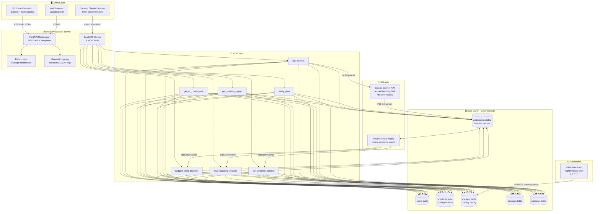

# System Architecture

## System Overview

The Recall architecture is structured into 5 core layers:

1. **Client Layer**:
   - Cursor & Claude Desktop integration via standard I/O (stdio) MCP JSON-RPC.
   - VS Code Extension sidebar providing quick access & background notifications.
   - Modern Web Dashboard built with FastAPI, Jinja2 templates, and Alpine.js.

2. **Server & Security Layer**:
   - FastMCP server registering 8 dedicated MCP tools.
   - SlowAPI rate limiting middleware enforcing 5 to 60 req/min limits.
   - Structlog structured JSON logging with ISO timestamps.

3. **Data Layer (CockroachDB)**:
   - Serverless distributed SQL database.
   - Stores 3,359 company-tagged LeetCode problems, topic masteries, attempts, and mistake history.

4. **AI & Vector Layer**:
   - Google Gemini API (`text-embedding-004`) generating 768-dimensional dense vector embeddings.
   - Cosine similarity vector search for recurring mistake pattern detection and weak topic problem recommendations.

5. **Automation Layer**:
   - GitHub Actions automated cron job executing nightly exponential mastery decay calculations (`0 0 * * *`).
